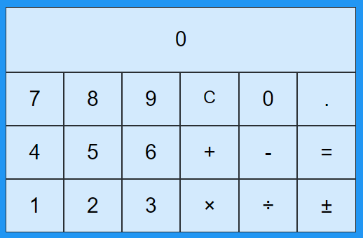

# Simple calculator demoing ***CSS Grid*** and basic ***Vue.js*** usage

Result is an `<input>` control by a `v-model` with allows user to enter digits directly in a controlled/filtered way

This filter is introduced by a `computed` property which is targeted by the `v-model`

The `set` method of this `computed` property analyzes the `input` value and if it rejects it, it will not update the `result` variable and set a flag

This flag state change will be seen by the `get` method which, through the `v-on` part of `v-model` will re-synchronize the `input` value with  contents of the `result` variable

[Codepen](https://codepen.io/Djee/pen/MRBwBr) playground